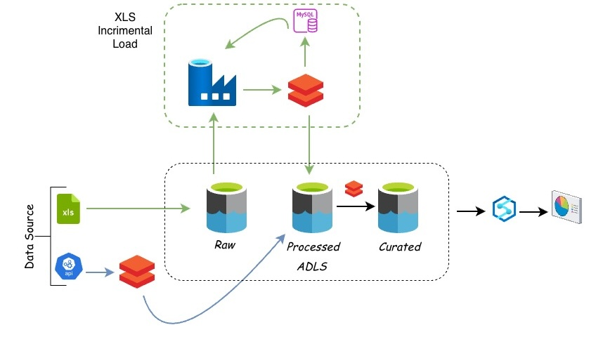
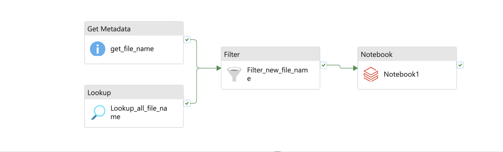

# azure-trade-data-engineering

## Project Overview

This project is an end-to-end data engineering pipeline built to analyze and compare India’s trade data using multiple sources.

It uses:
- **DGCIS India Trade dataset (XML/Excel format)**
- **Comtrade API dataset (global trade data)**

The pipeline is designed to ingest, clean, transform, and compare import/export trade data using **Azure Data Factory (ADF)** and **PySpark/Pandas**.

    
---

## Problem Statement

Trade data from multiple sources is often:
- Unstructured (XML / Excel / API responses)
- Inconsistent across systems
- Large in volume
- Difficult to compare directly

This project solves that by building a **scalable ETL pipeline** that:
- Ingests raw trade data
- Cleans and standardizes it
- Separates Import and Export records
- Enables comparison between India Trade (DGCIS) and Global Trade (Comtrade API)

---

## Architecture Overview

Data flows through the following stages:

1. **Data Ingestion (ADF)**
   - DGCIS XML/Excel files ingestion
   - Comtrade API ingestion

2. **Storage Layer**
   - Raw data stored in structured format

3. **Processing Layer (PySpark + Pandas)**
   - Data cleaning and transformation
   - Schema standardization
   - Deduplication and filtering

4. **Business Logic Layer**
   - Classification into Import vs Export
   - Data comparison between datasets

5. **Output Layer**
   - Cleaned and analytical-ready datasets

---

## ⚙️ Technologies Used

- Azure Data Factory (ADF)
- Apache Spark (PySpark)
- Python (Pandas)
- REST API (Comtrade API)
- XML / Excel data processing
- Git & GitHub

---

## 🔄 Data Sources

### 1. India Trade Data (DGCIS)
- Source: Government of India (DGCIS website)
- Format: XML / Excel files
- Contains import/export trade records for India

### 2. Comtrade API Dataset
- Source: United Nations Comtrade API
- Format: JSON API response
- Used for global trade comparison

---

##  Data Pipeline Workflow

### Step 1: Data Ingestion (ADF)
- Automated pipeline created in Azure Data Factory
- Ingests new files incrementally (manually triggered)
- Filters only newly added datasets
- Handles file-based ingestion (XML/Excel)

---

### Step 2: Data Cleaning & Transformation (PySpark + Pandas)

- Schema standardization across datasets
- Null value handling
- Type casting and formatting
- Removing duplicate records
- Filtering invalid trade entries

---

### step 3: PySpark Performance Optimizations Applied
- Used **repartition()** to optimize data distribution across Spark partitions for better parallel processing
- Used **broadcast join** for efficient joining of small and large datasets, reducing shuffle overhead
- Used partitioning based on Import/Export trade type to improve processing efficiency
- Optimized pipeline execution by reducing unnecessary intermediate transformations

---

### Step 4: Data Analysis & Visualization (Databricks)
Visualizations Performed:
- Import vs Export trade comparison
- Country-wise trade distribution analysis
- Commodity-wise trade flow patterns
- Comparison between India Trade (DGCIS) and Comtrade dataset

###  Tool Used:
- Databricks (for interactive analysis and visualization)

Databricks notebooks were used to generate visual insights directly from the processed PySpark DataFrames, enabling exploratory analysis and trade pattern understanding.
